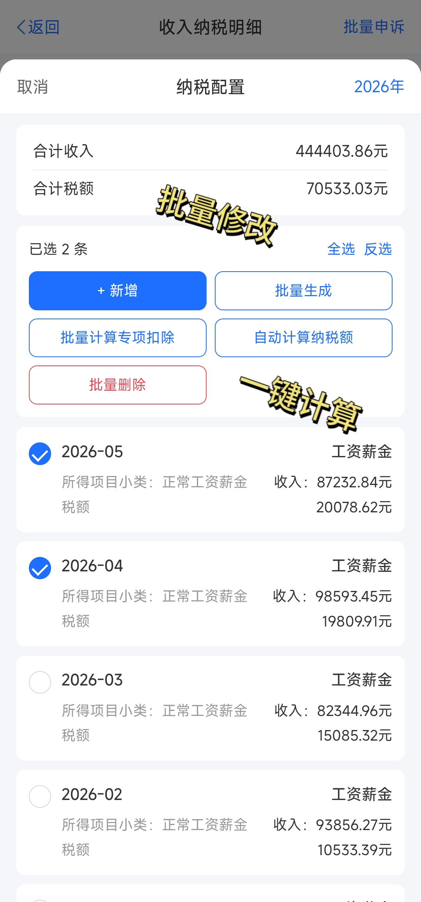

# 个税模拟器 个人所得税APP模拟器

### 介绍
本APP可模拟个税界面操作，实现个税学习、教学、演示使用。欢迎下载试用。

### 安装教程

#### 1.  前往 [下载地址](https://aka77.indevs.in/guide/) 下载安装包，安卓用户直接 **下载安装** ，
#### 2.  如果是 **苹果** 用户请联系网址中的联系方式
#### 3.  进入APP点击试用， **无需输入账号密码** 
#### 4.  长按头像开启数据配置弹窗

### 使用演示
#### 1.纳税明细

#### 2.个人中心

### 参与贡献

1.  暂无
